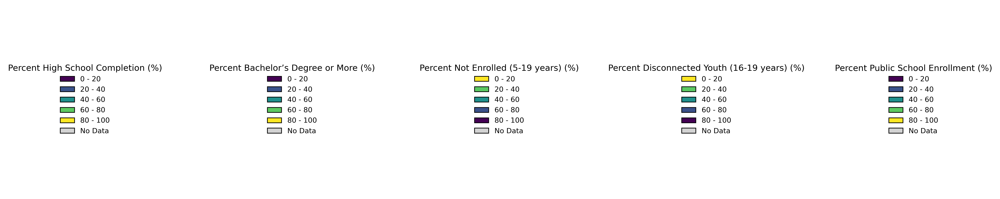

# Spatial Perspectives on Education in New Jersey
### Name: Shravani Kallur
### Command Line GIS - 34:816:651:90 | Taught by: Dr. Wenwen Zhang
### Edward J. Bloustein School of Planning and Public Policy

## About
This project aims to understand the broader spatial patterns of educational attainment, enrollment, and other relevant demographic or socio-economic indicators and explore the relationship between public school distribution and broader educational patterns in New Jersey. 

**Research Questions:** 
1. What are the spatial patterns of educational attainment (e.g., high school and higher degrees) across counties and census tracts in New Jersey?
2. How do enrollment rates vary across census tracts and counties in New Jersey?
3. How does the distribution of public schools align with regions of high or low educational attainment and enrollment?
4. Are there regions with limited school access that also exhibit lower educational outcomes?

## Data Sources
1. Census data for educational attainment and school enrollment rates - American Community Survey, CensusAPI
2. Policy Map - Public Schools: Enrollment and Demographics (NCES) in New Jersey (State)
3. Census_Tracts_20202C_3424.geojson - NJGIN
4. NJ_Counties_NGJIN_2021.geojson - NJGIN

## Education Indicators by Census Tracts in New Jersey (2022)
The set of maps illustrates the spatial distribution of key education indicators across census tracts in New Jersey for the year 2022. Each map uses a consistent classification scheme with defined intervals (20, 40, 60, 80, and 100%) and a unique color gradient to highlight variation in educational attainment, enrollment, and youth outcomes. These maps aim to uncover regional patterns and disparities in education-related metrics.  

Each map uses **low-reliability hatching** to indicate areas where data quality or sample sizes may limit interpretability. County boundaries and labels provide additional geographic context, while legends and consistent color schemes ensure readability and comparison across indicators.  

  **Description of Maps:**  
1. **Percentage of People with at Least a High School Diploma (25 years & older):** Highlights the proportion of the population aged 25 and older who have completed high school. Higher percentages are predominantly observed in urban and suburban tracts, with lighter areas representing lower levels of attainment.  
2. **Percentage of People with a Bachelor’s Degree or More (25 years & older):** Shows the proportion of residents with at least a bachelor's degree. Urban centers and affluent suburban areas exhibit higher percentages, while rural and economically disadvantaged areas lag behind.  
3. **Percentage of People Not Enrolled in School (5–19 years):** Indicates the proportion of the school-aged population (5–19 years) not currently enrolled in school. The reversed color scheme highlights areas with concerningly high non-enrollment rates, suggesting potential challenges in educational access or retention.  
4. **Percentage of People Enrolled in Public School (5–19 years):** Depicts the proportion of school-aged children enrolled in public schools, reflecting the reliance on public education systems across the state. Variations in enrollment patterns may correlate with socioeconomic or geographic factors.  
5. **Percentage of Disconnected Youth (16–19 years):** Focuses on youth aged 16–19 who are neither enrolled in school nor participating in the labor force. Areas with higher percentages of disconnected youth, indicated by darker shades, point to regions where young people face challenges in accessing education or employment opportunities.  

## Explore the interactive map below: 

<object data="(https://srk194.neocities.org/Edu_Attain_Indicators_3)" width="100%" height="600">
    <embed src="https://srk194.neocities.org/Edu_Attain_Indicators_3" width="100%" height="600"> </embed>
    Error: Embedded data could not be displayed.
</object>

<iframe src='http://srk194.neocities.org/Edu_Attain_Indicators_3'  width="100%" height="600px"></iframe>

<section>
    
The legend for the education indicators is shown below:

        
</section>
   
You can explore [this map as its own web page here](http://srk194.neocities.org/Edu_Attain_Indicators_3)

The interactive map provides a dynamic exploration of educational indicators and public school data across New Jersey. Users can toggle between multiple layers, including:  
- **School Heat Map:** Visualizes the density of schools across the state, with brighter areas indicating higher concentrations.  
- **Educational Indicators:** Includes layers for various educational metrics, such as high school completion rates, bachelor's degree attainment, public school enrollment percentages, and disconnected youth rates. Each layer uses a consistent classification scheme and intuitive color gradients for easy comparison.  
- **School Points:** Displays individual schools with markers color-coded by status (e.g., open, closed, or new). Clicking on a marker reveals detailed information about the school, including its name, address, and educational level.  

Users can also switch between base maps (**OpenStreetMap** and **CartoDB Positron**) for additional contextual layers. The map allows for a deeper understanding of spatial patterns in education while offering flexibility for specific inquiries and visual exploration.
